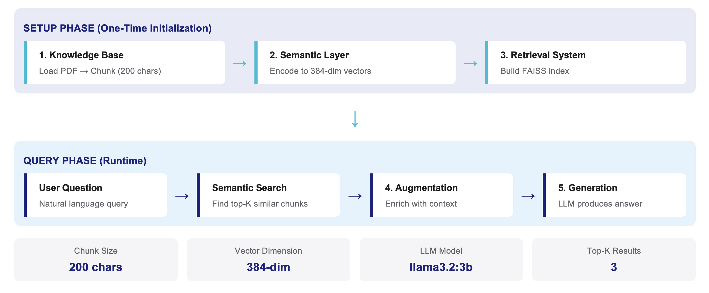

# RAG Pipeline Project – HPE Private Cloud AI SUPPORT DOCUMENTATION PDF



## Overview
This project implements a **minimal Retrieval-Augmented Generation (RAG) pipeline** using a PDF knowledge base. The pipeline answers user queries by retrieving relevant content from the document and synthesizing a response.

---
| Component      | Library/Tool                               | Reason                                  |
| -------------- | ------------------------------------------ | --------------------------------------- |
| PDF Parsing    | PyPDF2                                     | Extract text from PDF pages             |
| Text Chunking  | Regex-based sentence tokenizer             | Avoids NLTK issues on macOS/Python 3.12 |
| Semantic Layer | sentence-transformers (`all-MiniLM-L6-v2`) | CPU-efficient embedding model           |
| Retrieval      | FAISS IndexFlatL2 similarity               | Lightweight and easy to debug           |
| Augmentation   | Python string formatting                   | Flexible, no extra dependencies         |
| Generation     | LLM: Ollama(`Llama 3.2 (3B parameters)`)   | Generates grounded answers              |


## Project Components

### 1️⃣ Knowledge Base
**Goal:** Load and organize the data for efficient retrieval.

- **Tool:** Python + PyPDF2
- **Method:** 
  - Load PDF pages into memory.
  - Split text into **sentence-preserving chunks** with overlap.
- **Why:** 
  - PDF documents are structured by page. 
  - Chunking ensures long pages can be split into smaller semantic units suitable for embeddings, avoiding truncated information.
  - Overlapping preserves context between chunks.

**Example:**
```python
kb = KnowledgeBase(pdf_path="data/hpe-pcai.pdf")
documents = kb.load_pdf_data()
chunks = kb.create_chunks()
```
### 2️⃣ Semantic Layer

**Goal:** Transform text and queries into dense vector embeddings for semantic search.

- **Tool:** sentence-transformers (model: all-MiniLM-L6-v2)

- **Method:**
    - Encode each chunk into a 384-dimensional vector.
    - Encode queries into the same vector space.

- **Why:**

    - MiniLM-L6-v2 is lightweight and CPU-friendly, suitable for local execution.

    - Normalized embeddings allow cosine similarity comparisons for semantic matching.
```
semantic = SemanticLayer()
document_embeddings = semantic.encode_documents(chunks)
query_embedding = semantic.encode_query("What are pcai core tools?")
```

### 3️⃣ Retrieval System

**Goal:** Find the most relevant chunks based on semantic similarity.

**Tool:** Custom Python search with FAISS IndexFlatL2 (normalized)

**Method:**
- Compute similarity between query embedding and each document embedding.
- Return top k matches.

**Why:**
- Semantic search allows retrieving contextually relevant information, not just keyword matches.
- Top-k retrieval ensures that only the most meaningful content is passed to the generation step.

Example:
```
results = retrieval.search(query_embedding, top_k=3)
```

### 4️⃣ Augmentation

### Goal
Combine retrieved context with the original question to form enriched input.

### Tool
Custom Python string formatting

### Method
Concatenate retrieved chunk contents with metadata (page number, similarity).

Include the original query and instructions.

### Why
Prepares a coherent input for the generation step.

Ensures the final response is grounded in retrieved knowledge.

### Example
augmentor = Augmentation()
enriched = augmentor.create_context("What are pcai core tools?", results)

## 5️⃣ Generation

### Goal
Produce a final answer using the enriched context.

### Tool
LLM based generation - via Ollama running a model like Llama 3.2:3b locally

### Method
Combine query + retrieved context into structured prompt

Generate natural language answer using Ollama LLM

### Why
Context-grounded: LLM generates answers based solely on retrieved documents, reducing hallucination

Source attribution: Users can verify information against original documents


Example:
```
generator = Generation(model_name='llama3.2:3b', use_llm=True)
answer = generator.generate(enriched, results)
```
### 6️⃣ Testing & Validation

### Goal
Verify embeddings, chunks, and retrieval.

### Method
- Print random chunks and corresponding embeddings to ensure:
  - Chunks are correctly formed.
  - Embeddings are numeric arrays of correct dimension.
  - Test queries with `ask_question()` to validate the full pipeline.

Example:
```
ask_question("What are pcai core tools?")
```


## Quick Start

### Prerequisites
- macOS (Apple Silicon recommended)
- Python 3.8+
- 8GB RAM minimum

### Setup and Run
```bash
# 1. Check if Ollama is installed and running
if ! command -v ollama &> /dev/null; then
    echo "Installing Ollama..."
    brew install ollama
fi

# 2. Start Ollama service
if ! pgrep -x "ollama" > /dev/null; then
    echo "Starting Ollama..."
    ollama serve > /dev/null 2>&1 &
    sleep 3
fi

# 3. Download LLM model (first time only, ~2GB)
if ! ollama list | grep -q "llama3.2:3b"; then
    echo "Downloading model..."
    ollama pull llama3.2:3b
fi

# 4. Setup Python environment
python3 -m venv rag-venv
source rag-venv/bin/activate

# 5. Install dependencies
pip install -r requirements.txt

# 6. Start Jupyter
jupyter notebook
```

